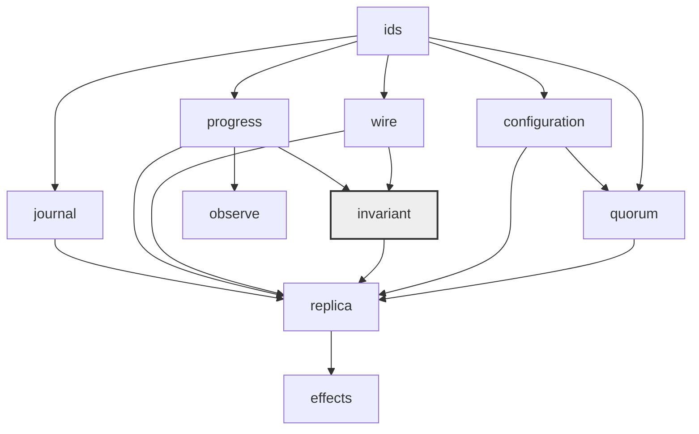

# Architecture

`vrr-core` is a SANS-I/O library with a C ABI, not a framework. It never tells the host
what to do.

Section references are to `docs/vrr-durability-model.md`. Rulings are the decision
record at the end of this document.

## Closed for modification

The VSR-2012 invariants and the quorum-intersection obligations. Specifically:

```text
R1: QI_e ⌢ QII_e            (§8.7.4)
R2: QI_e ⌢ QII_(e+1)        (§8.7.4)
F_g ⌢ R_g                   (§8.3, diskless)
V_g ⌢ V_g                   (§8.3, diskless self-intersection)
```

These are mechanically checked — the family-intersection obligations by the free
functions `quorum::validate_era`/`quorum::validate_transition`, the
transition-legality rules by `invariant::legal`. No host, feature flag, or extension may
weaken them. `V_g ⌢ V_g` is called out separately because it does not follow from
`QI ⌢ QII` alone, and its absence is the usual way a flexible-quorum
policy satisfying `QI ⌢ QII` is nevertheless an invalid VRR-2012 policy. The
open/closed ruling itself, with the counterexample that makes the gate necessary, is Q1
in the decision record below.

## Open for extension

Quorum families, journal durability, packetization, state transfer, clocks, security, node
naming and node-id assignment, transaction and locking discipline.

These are host policy. We ship a default and a trait; we do not ship a choice.

## We do not ship configurations

We write protocols in Rust. A design decision that *precludes* a legal host policy is a
defect, and is to be reported as one.

## The clock is externalised

The core performs no clock reads. The transition is

```text
tick + message + state -> state + list(messages)
```

Every input carries the host tick, and for a recovery input that tick is a recovery
nonce; the attempt retains a bounded set of them, one per re-drive (§6.1, S4).

## Modules

| Module | Responsibility | Spec |
|---|---|---|
| `ids` | node, view, slot, message identity; `ViewId { era, view }` | §1.2, §1.3, A1 |
| `wire` | normative binary codec; optional serde and JSON bridges | §13.1, W3 |
| `journal` | the four logical journal capabilities, and no fifth | §4, S1 |
| `progress` | the `Progress` record and its cross-strategy invariants | §5 |
| `observe` | lockless seqlock observation of published progress | §12, B1 |
| `invariant` | the closed transition-legality checker | §5, §8.7.3, §15 |
| `configuration` | era, membership, weights, reconfiguration operations | §8.7.1–§8.7.8 |
| `quorum` | quorum families by role; the `QuorumStrategy` extension point and the closed `validate_era`/`validate_transition` gate | §8.1–§8.7.5 |
| `replica` | types, lifecycle, and the plan/publish/confirm pipeline | §6, §7, §12 |
| `replica::normal` | `Prepare`/`PrepareOk`/`Commit`; proposal admission | §4, §11.1, §13.3 |
| `replica::view_change` | `StartViewChange`/`DoViewChange`/`StartView`; the win; admin force | §9, §13.1, §14.2 |
| `replica::recovery` | `Recovery`/`RecoveryResponse`; completion and re-drive | §10, §6.1 |
| `replica::transfer` | state transfer sequencing; sizing is the host's | §4, §13.1, W5 |
| `replica::reconfiguration` | membership and weight change; not yet implemented | §8.7.1–§8.7.8 |
| `effects` | the output half of the transition, as inert data | §6, §7 |

## Module dependency graph



`ids` depends on nothing. `Fault` lives in `ids`, not in `invariant`,
precisely so that `invariant::legal` can consume `Progress` without `progress` importing
anything back from `invariant`: that edge would close a cycle, and cycles are
prohibited. `invariant` re-exports `Fault` so existing citations keep compiling.
`quorum` depends on `configuration` and `ids` and holds the closed family-intersection
gate as free functions (Q1); `invariant` holds the closed transition-legality checker.
Both are depended on by `replica`, so no path reaches a proposal without passing the
gates. `effects` is a leaf: nothing in the core consumes an effect, because effects are
returned to the host, never performed. `observe` reads `progress` and is read by nothing
inside the core; it exists for the host and the C ABI.

The graph above is acyclic, and stays so by ruling. A proposed edge that would create a
cycle is a signal that a responsibility is in the wrong module.

## Decision record

Each decision states context, decision, consequence. These are rulings, not proposals.
A later item may not contradict one; it may only supersede one by amending this section
and saying so.

Identifiers are per-domain: `W` identity & wire, `S` durability & stability, `Q` quorum
policy, `B` application boundary, `P` process & hygiene. Numbering is within the domain.
Section references are to `docs/vrr-durability-model.md`.

### Identity & wire

#### W1 — Explicit `ViewId { era: u32, view: u32 }`, 20-byte big-endian header

**Context.** §8.7.3 packs the view number as `view = (era << k) | index`, with `k` low
bits for the primary-selection index. It requires checked encoding and forbids
wraparound.

**Decision.** Superseded. A view is `ViewId { era: u32, view: u32 }`. The wire header is
20 bytes big-endian: `(tag: u32, era: u32, view: u32, slot: u64)`. No bit packing appears
anywhere in the wire format. Recorded as Amendment A1 at the end of
`docs/vrr-durability-model.md`; §8.7.3 is left unedited so its reasoning survives.

**Rationale.**

1. Packing fixes `k` at genesis and bounds era and index *simultaneously*. A cluster that
   outlives its `k` has no migration path that is not itself a reconfiguration protocol.
2. Overlap-mode routing must be explicit. §8.7.3's own relation
   `era(view) + 1 >= era(slot) >= era(view)` means a host dispatching by era would have to
   decode a protocol number to make a transport decision. Era becomes a first-class header
   field instead.
3. Two independent `u32` fields cannot alias, so checked encoding and the wraparound
   prohibition are discharged by construction rather than by validation.

**Consequence.** Four extra bytes per datagram versus a packed `u64`. Primary selection,
legal view-number gaps, and the rule that a replica may propose a view only if its
accepted history contains that era's establishing reconfiguration are all unchanged.

#### W2 — No `uuid`; identifiers are host-supplied

**Context.** The alpha depended on `uuid` with the `v4` and `serde` features to mint
identifiers, which requires a randomness source inside a library that is supposed
to have no ambient inputs.

**Decision.** Identifiers are host-supplied: `OperationId` is the example. The host
supplies it. The core never mints one.
`uuid` is removed and must appear nowhere in the manifest.

**Consequence.** A host that wants UUIDv4 identifiers can produce them; a host with an
existing correlation-id discipline uses that instead; a deterministic simulation harness
uses counters. Combined with W3 this makes the non-optional dependency set empty, which is
what `tests/manifest_contract.rs` gates.

#### W3 — Own binary codec in `wire`, optional serde derives, JSON debug bridge

**Context.** The alpha put JSON in the datagram path. §13.1's bounded view-change suffix
requires the encoded size of a candidate history suffix to be computable exactly before it
is sent.

**Decision.** A binary big-endian codec in `wire` is normative. `serde` derives sit behind
the `serde` feature. A binary-to-JSON debug bridge sits behind `maelstrom`.

**Rationale.** Binary on the wire makes the §13.1 suffix budget deterministic — a
serializer whose output length depends on number formatting cannot answer "does this
suffix fit". Serde derives behind a feature let a host impose its own encoding without
forking. The debug bridge means the *binary* path is the one under test while the failure
output is still readable; a JSON-native debug path would exercise the wrong codec.

**Consequence.** Two encoders to keep in step, and a round-trip property test is
mandatory rather than optional.

**Amendment.** The dev-dependency allowlist that bounds the round-trip test's format is
decision P3.

#### W4 — Fixed-width big-endian, no varints

**Context.** A variable-length integer encoding is smaller on the wire.

**Decision.** Every integer is fixed-width big-endian. No varints, no zigzag, no bit
packing.

**Rationale.** W3's entire justification for a binary codec is that `packed_len()`
answers "does this suffix fit" *exactly*, before any bytes are produced. A varint's
length depends on its value, so a suffix budget becomes a search rather than a sum.
Big-endian because it is the network order the wire already implies and because it makes
a hex dump readable in the same order as the struct definition.

**Consequence.** Larger datagrams than a varint encoding. Accepted — the host owns
packetization (W5) and can compress a whole datagram if it cares, which is a better place
for that trade than inside a protocol invariant.

#### W5 — No `MAX_DATAGRAM` in the core

**Context.** The alpha embedded datagram sizing, so the core made packetization decisions
using a constant chosen at compile time by someone who did not know the transport.

**Decision.** No maximum datagram size, chunk size, or fragment count constant exists in
the core. Encoders report the size they require; decoders report incomplete input. The
host owns all packetization and all state-transfer sizing.

**Consequence.** Every encode site returns a required-size signal that callers must
handle, and every decode site distinguishes "malformed" from "incomplete". More surface
area in the codec API, in exchange for a core that cannot be wrong about an MTU it was
never told.

### Durability & stability

#### S1 — Journal reclamation is host policy and is absent from the trait

**Context.** §4 lists exactly four required journal capabilities: identify the accepted
frontier, read history, record acceptance, record a view selection. It lists no physical
retention operation, and states explicitly that none of truncation, rotation, segment
management, size threshold, age threshold or minimum retention is a VRR-2012 state
transition.

**Decision.** The portable `Journal` trait contains no reclamation operation. A host
implements whatever retention policy it likes without exposing it to the core, provided it
either satisfies a protocol read or reports the requested history unavailable — at which
point recovery or state transfer obtains an adequate state elsewhere.

The default `SegmentedLog` reclaims lazily and opportunistically on append, gated on a
published checkpoint. Few knobs: initial slab capacity, growth factor, shrink hint. A unit
or stress run that never reclaims at all is a legitimate configuration, not a leak.

**Consequence.** No host can be locked out by a retention obligation it cannot meet, and
no test can be flaky because reclamation ran at an inconvenient moment. The cost is that
disk growth is not the core's problem and the core will not warn about it.

#### S2 — Stability is `plan` / `publish` / confirm; no host callbacks across the ABI

**Context.** §7 and §12 require the host to serialize the publication interval. A
callback-based durability hook is the conventional design.

**Decision.** A three-phase handshake: the core produces a `plan`, the host performs the
durability action, the host `publish`es and confirms the outcome. No host callback is
invoked from inside the core, and none crosses the C ABI.

**Rationale.** A callback invoked inside `publish` would re-enter the §12 serialized
transition interval. The reentrancy is not analysable, and across a C ABI it is not even
type-checkable.

**Consequence.** `begin`/`end` and `lock`/`unlock` are documented host-side **wrapping**
patterns, not core traits — the host wraps its call to the core, the core does not call
into the host's transaction. §11.1 (application inside the host transaction) and §11.2
(application outside it) are both expressible, which is the point.

#### S3 — Three-way `StabilityResult`

**Context.** A persistence attempt has three outcomes, not two: it succeeded, it
definitely did not succeed, or the host cannot tell.

**Decision.**

```text
StabilityResult = Stable { receipt }
                | Failed { reason }
                | Indeterminate { reason }
```

Only `Indeterminate` sticky-faults the node (§5, invariant 5). `Failed` leaves the
previously published state visible and observable.

**Rationale.** Collapsing "it definitely did not happen" into "it might have happened"
discards exactly the information that distinguishes a retry from a recovery. A determinate
failure is a normal, survivable event; treating it as a fault converts a full disk into an
outage.

**Consequence.** Hosts must be able to report indeterminacy honestly. A host that reports
`Failed` for a timeout it cannot actually disprove has violated the contract, and the
resulting divergence is the host's, so this is stated in the trait's documentation and not
merely assumed.

#### S4 — Externalised clock; the recovery nonce is the host tick

**Context.** §6.1 makes `TimedInput.at` an opaque host-supplied `u64` and derives the
recovery nonce from it. The alpha took a caller-supplied nonce separately from time,
allowing the two to disagree.

**Decision.** Every input carries the host tick. The core performs no clock reads. For a
recovery input the tick **is** a recovery nonce, and the attempt retains a bounded set of
them, one per re-drive. `Input::Tick` exists as an ordinary
event.

**Rationale.** One value cannot disagree with itself. The §6.1 invariant — no recovery
attempt may reuse a nonce while a message from an earlier attempt can still be delivered —
becomes a property of the host's declared clock strategy, which §6.1 already tabulates for
continuous-nanosecond, continuous-millisecond, and resettable clocks. `Input::Tick` as an
event rather than a timer callback lets a harness replay sloppy, late, early and reordered
timeouts deterministically; a timeout the core cannot be *told* about is a timeout no test
can reproduce.

**Consequence.** The core needs no monotonic-clock abstraction and no time crate. A host
with a resettable clock must construct a fresh `u64` by another method (§6.1); the core
cannot detect that failure and does not pretend to.

### Quorum policy

#### Q1 — Open/closed: quorum families are an extension point, intersection is closed

**Context.** §8.2 argues that quorum policy is a family of legal sets, not a count.
§8.4 admits weighted families, §8.5 admits the even-node split `V_g = k+1, C_g = k`, and
§8.7 admits reconfiguration by voting weight. These are genuinely different operational
profiles with different latency and availability, and only the host knows which it wants.
But every one of them must still satisfy the intersection obligations, and the obligations
are not obvious enough to leave to reviewers.

**Decision.** `QuorumStrategy` is an extension point. The obligations
`R1: QI_e ⌢ QII_e` and `R2: QI_e ⌢ QII_(e+1)` (§8.7.4), together with the diskless
obligations `F_g ⌢ R_g` and `V_g ⌢ V_g` (§8.3), are closed for modification and are
mechanically checked in `crate::invariant`. No host, feature flag, or extension may weaken
them. Validation is over families, not counts: the threshold inequality `T_a + T_b > W`
(§8.4) is sufficient but not necessary for an arbitrary indivisible weight assignment, so
a strategy validated only by thresholds is treated as unvalidated.

`WeightedMajority` is the default, because §8.7.5 proves its closure across consecutive
eras. `EvenSplit` ships as a non-default *reference* strategy to prove the
extension point admits the six-node three-datacentre profile. We ship a default and a
trait. We do not ship a choice.

The mechanical check lives in `crate::quorum` as the free
functions `validate_era`/`validate_transition`, not as `invariant` code and not as trait
methods: free functions are what makes the gate un-overridable by a strategy value.
`invariant` retains the transition-legality checker `legal`. The discharge mechanism is
exhaustive subset enumeration over the membership, bounded by
`configuration::MAX_MEMBERS = 16` — a validation-cost bound, not a protocol limit.

**The counterexample that makes the gate necessary.** Six members, all unit weight, so
`T = 6`. A commit threshold of `C = 4` and a view-change threshold of `V = 4` both
intersect within an era. Now propose `INCREMENT(n0)`:

```text
era e:      W = (1,1,1,1,1,1),  T = 6
era e+1:    W = (2,1,1,1,1,1),  T = 7

V_e     = 4  admits  {n1,n2,n3,n4}          weight 4 under era e
C_(e+1) = 3  admits  {n0,n5}                weight 3 under era e+1

{n1,n2,n3,n4} ∩ {n0,n5} = ∅
```

`R2` is violated: a view change in era `e` can select a history that omits an operation
committed by the era-`e+1` commit quorum. The validator must **refuse `INCREMENT(n0)`
before it is proposed**. Detecting this after the reconfiguration commits is worthless —
the divergence is already reachable and no later check can un-commit it.

**The half-total threshold note.** `C = floor(T/2)` gives `C + V = T` when `T` is odd,
which means the two families may be exactly complementary and share no member at all. A
half-total commit threshold is therefore admissible **only for even totals**, which is
precisely the §8.5 case `T = 2k`, `C = k`, `V = k+1`, where `C + V = 2k + 1 > T`. Any
strategy offering a half-total threshold must reject odd totals rather than round.

**Consequence.** `invariant` refuses configurations and reconfiguration operations, not
just messages. A `QuorumStrategy` that cannot enumerate or characterise its families well
enough to be validated is not usable, and that is intentional.

#### Q2 — The voting-weight domain {0,1,2}; join at 0, leave at 0; era batches move ≤ 1 unit of mass

**Context.** Voting weights are common factors: `18/27` is `2/3`, so no node ever needs a
weight above `2`, and a uniform double or halve is a zero op on quorum families. Standbys
— TigerBeetle's term for its non-voting cluster members (weight 0; older drafts called
them learners) — never vote and are not counted against any quorum: standby nodes have a
zero voting weight so cannot form part of any quorum nor actively participate in the VSR
algorithm. A nine-node deployment
of three voting nodes across three data centres is a three-node cluster with six warm
standbys. Reconfiguration must be checkable *before* it is proposed, with no way to
compress a two-step identity swap into one era.

**Decision.** The voting-weight domain is `{0, 1, 2}` (`configuration::MAX_WEIGHT = 2`).
A node joins at weight 0 and leaves only at weight 0; there is no operation that joins
elsewhere and no legal fold that removes a voter. Zero-weight standbys receive prepare
and commit traffic so they stay swappable in, and every replica discards
vote/view-change messages from a non-voting identity (the `Reincarnation` announcement is
the one exempted message). One reconfiguration commits a **batch**: either one solitary
scaling operation (`DOUBLE`/`HALVE` — refused with company), or a unit batch whose
per-node mass moved `Σ|W_before(a) − W_after(a)|` over the union node set is at most `1`.
The rule is stated over per-node mass moved, not over the net total change: the
zero-net, mass-2 identity swap is refused, and a leader crash cannot compress it.
The leader evaluates any batch as a what-if on an immutable clone before proposing it,
and the reducer partitions an operation stream into maximal legal era batches
(`src/reconfiguration.rs`). The itemized rules are
`docs/uvrr-reconfiguration-rules.md`.

**Rationale.**

1. The named mathematics is enough: two strict majorities intersect by the pigeonhole
   principle; majorities intersect when per-node mass moved is ≤ 1 (Turner's UPaxos
   Lemma 2, formalized as ladder rung 9 `WeightedGeneral.scaled_overlap`); uniform
   scaling preserves every quorum family by common-factor normalization.
2. A net-total rule alone would admit the mass-2 swap `(1,1,1) → (1,1,c:0,d:1)`, whose
   era-`e` majority `{b,c}` and era-`e+1` majority `{a,d}` are disjoint — exactly the
   Q1 counterexample shape, caught here before consensus rather than after.
3. More eras are free (§8.7.2's non-stop transition makes each one cheap); proving that
   two commands acted as one without a violation is work no one needs to do twice.

**Consequence.** The fold refuses any operation or batch that would leave the domain
{0,1,2}, join or remove a voter, combine scaling ops with anything, or move more than one
unit of per-node mass. Cluster state is an immutable snapshot plus a WAL of legal
operations; there is no Crash-Recover by design — a dirty node reincarnates under a new
identity and the leader drives the forced sequence
(`docs/uvrr-reincarnation.md` §6).

### Application boundary

#### B1 — Seqlock over a POD snapshot for lockless observation

**Context.** §12 requires the host to serialize the transition interval. Diagnostics,
metrics and the C ABI must read `Progress` from outside that interval. The obvious
alternative is an `Arc` swap with reader counting.

**Decision.** A seqlock over a plain-old-data snapshot. Even sequence means stable, odd
means write in progress, a reader that observes a torn read retries. Not `Arc` swap.

**Rationale.** There is **no reclamation race to prove**. Nothing is freed, so there is no
epoch scheme, no hazard pointer, and no deferred drop whose soundness argument would have
to be re-established by every later item that touches the snapshot layout. The failure
mode we are buying out of is the one that does not reproduce under test.

**Consequence.** A reader may spin under a write storm. Acceptable: writes are bounded by
the transition rate and the snapshot is a handful of words. `unsafe` is confined to
`observe` and `ffi`; the crate carries `#![deny(unsafe_code)]` rather than `forbid`
precisely so those two modules can each hold one scoped, documented exception.
Observation is read-only without exception (§15): no mutation through diagnostic,
transport, timer or transfer side channels.

#### B2 — The core orders opaque operations; clients are a host concern

**Context.** The VRR-2012 paper ships a per-client table (latest request number plus
cached result per client, at most one outstanding request per client) as duplicate
suppression and result replay for a request/response service shape. A generic
embeddable core cannot assume that shape: hosts include fire-and-forget producers,
streamed pipelines, and proxies with their own retry semantics. Modelling clients
inside consensus couples the protocol to one transport shape and forces table
propagation through every view-change and recovery message as protocol evidence.

**Decision.** An operation is `{ id: OperationId, payload: bytes }` where
`OperationId` is an opaque 128-bit correlation token `{ msb: u64, lsb: u64 }`. The
core never compares identifiers for duplicate detection, never assigns retry
semantics, and never suppresses a repeated identifier — the host protocol decides
whether a repetition is a retry, a duplication, or another valid invocation. Every
replica emits the same ordered `(slot, OperationId, payload)` application upcall;
the host answers with `Applied { slot }`, which carries no result. Application
results never enter consensus state. A host may keep an ephemeral
`OperationId → pending request` association and returns a result only while that
association exists, discarding it otherwise; a crash clears associations, so an I/O
failure leaves the write outcome unknowable to the caller, who must reconnect and
query according to the host protocol. Transport, leader forwarding, connection
tracking, and response formatting remain host extensions.

**Recorded API consequences** (normative for the implementation items that follow):

- `OperationId` replaces `ClientId`, `RequestNumber`, and client-semantics uses of the
  16-byte message-correlation identifier, which is thereby fully superseded and
  removed from the public surface.
- `Input::Client` becomes `Input::Propose { operation }`; every application-origin
  log entry stores the complete identifier and the opaque payload.
- `Effect::Apply` carries `{ slot, operation_id, payload }`; `Input::Applied` is
  `{ slot }` only.
- Protocol `Request`/`Reply` messages as client transport, `Effect::Reply`, all
  client tables, cached results, merge rules, result re-drive state, and
  client-table fields in view-change and recovery messages are removed. Correlation
  identifiers survive view change and recovery because they are part of the log
  entries themselves; no table is protocol evidence.

**Consequence.** Multiple operations from one host may be in flight concurrently.
Submitting one identifier twice is not silently deduplicated. Only a host retaining
a pending association returns an application result; every other replica discards
it. The client-table design explored during the rewrite is superseded and must not
be integrated. A demonstration application (a clustered diskless byte stack) is
deferred until after the full verification gate; its transport choices remain host
decisions and set no core precedent.

### Process & hygiene

#### P1 — `.tmp/` is never committed

**Context.** `.tmp/` is the working-tree scratch directory: untracked artifacts
such as captured outputs and the overlap crash matrix's `failure.log` live there.

**Decision.** `.tmp/` is scratch and is never committed. The `.gitignore` entry
is written `.tmp/` with the trailing slash so it unambiguously names a directory.
Normative documents live in `docs/` and are tracked.

**Consequence.** Scratch artifacts such as `failure.log` stay on disk untracked;
the overlap crash matrix mines it for regression signatures from the working
tree, not from history.

#### P2 — MIT

**Context.** `Cargo.toml` declared `Apache-2.0`. `LICENSE` is MIT and `README.md` says
MIT. Two of three sources agreed.

**Decision.** MIT. `Cargo.toml` is corrected.

**Consequence.** `tests/manifest_contract.rs` asserts `license = "MIT"` and asserts that
no residual `Apache` string remains, so the disagreement cannot silently return.

#### P3 — Dependency stance: empty non-optional set, allowlisted dev-dependencies

**Context.** The W3 `--features serde` round trip needs some format to serialize
*through*. An earlier attempt hand-rolled a `Serializer`/`Deserializer` pair inside
`tests/wire_contract.rs` to avoid a `serde_json` dev-dependency. That was the wrong
trade, and is reverted: 370 lines of hand-rolled serde plumbing exercises *serde*, not
our codec, and carries a maintenance cost forever for no return.

**Decision.** `proptest` is already a dev-dependency, so the project's position is
already settled: a dev-dependency is build-time tooling for `cargo test`, not a
consumer's supply chain, and `tests/manifest_contract.rs` correctly gates only
`[dependencies]` — a library consumer's non-optional dependency set stays empty either
way. The concession is bounded by an explicit allowlist rather than left open:
`[dev-dependencies]` names exactly `{proptest, serde_json}`, asserted by
`tests/manifest_contract.rs`, so a third entry requires an amendment here rather than a
quiet commit.

**Consequence.** `serde` and `serde_json` remain `optional = true` under
`[dependencies]`, and `cargo tree -e normal --no-default-features` still prints the crate
alone.
